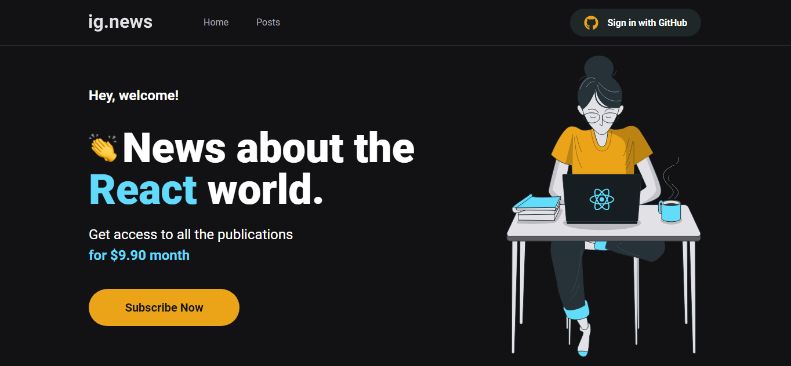
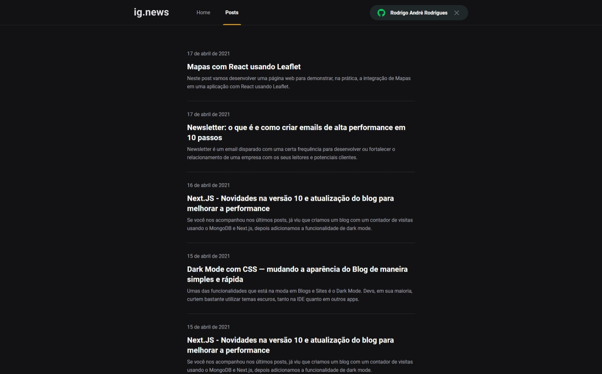

## Hello World
Blog pago utilizando o Stripe como meio de pagamento e o Faunadb como armazenamento de dados dos clientes registrados. Para isso, foi usado: 
</br>
✔ NextJS</br> 
✔ Next-auth</br>
✔ Prismic</br>
✔ Sass</br>
✔ Stripe</br>
✔ Faunadb</br>
✔ Axios</br>
✔ Typescript</br>
✔ React-icons</br>

Esse projeto é 100% funcional então é possível publicar esse projeto e gerar uma renda extra ou montar uma newslatter. 
</br>
É possível aplicar o conceito desse projeto de múltiplas formas para torná-lo mais completo ou fazer algo totalmente diferente do existente. Pense e crie 😁 

## Getting Started

Primeiro, rode esses comandos no seu terminal para instalar as dependências do projeto:

```bash
npm install
#or
yarn 
```
Para rodar sua aplicação utilize o camando:

```bash
npm run dev
# or
yarn dev
```

Será aberto em [http://localhost:3000](http://localhost:3000) o resultado desse projeto.

Logo, será possível visualizar a seguinte página: 



E acessando a página de posts, será possível visualizar a seguinte página:



## .ENV
É necessário definir as variáveis ambientes para esse projeto funcionar de forma correta. Para isso, crie na raiz do seu projeto um arquivo .env para as seguintes variáveis: 
</br>

```bash
✔ PRISMIC_TOKEN</br> 
✔ PRISMIC_ENDPOINT</br>
✔ DATABASE_KEY</br>
✔ NEXT_PUBLIC_STRIPE_PUBLIC_KEY</br>
✔ STRIPE_WEBHOOK_SECRET</br>
✔ STRIPE_API_KEY</br>
✔ GITHUB_CLIENT_SECRET</br>
✔ GITHUB_CLIENT_ID</br>
```
## Learn More

To learn more about Next.js, take a look at the following resources:

- [Next.js Documentation](https://nextjs.org/docs) - learn about Next.js features and API.
- [Learn Next.js](https://nextjs.org/learn) - an interactive Next.js tutorial.

You can check out [the Next.js GitHub repository](https://github.com/vercel/next.js/) - your feedback and contributions are welcome!

## Deploy on Vercel

The easiest way to deploy your Next.js app is to use the [Vercel Platform](https://vercel.com/new?utm_medium=default-template&filter=next.js&utm_source=create-next-app&utm_campaign=create-next-app-readme) from the creators of Next.js.

Check out our [Next.js deployment documentation](https://nextjs.org/docs/deployment) for more details.
